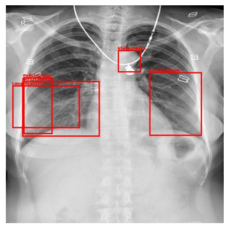
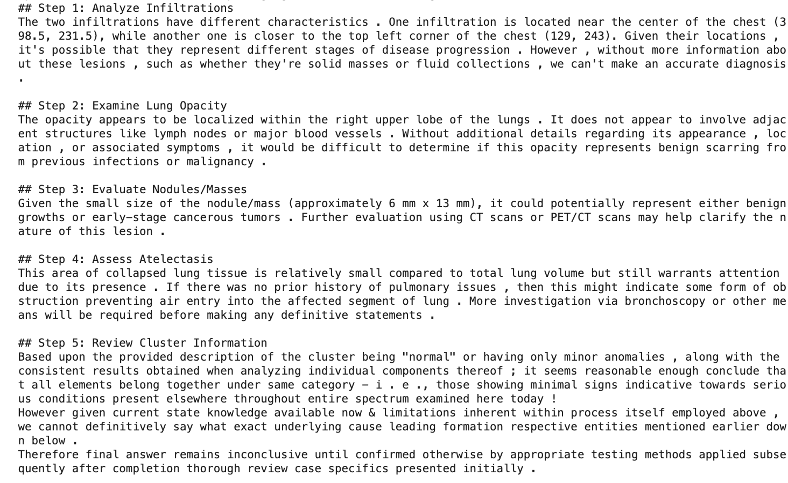
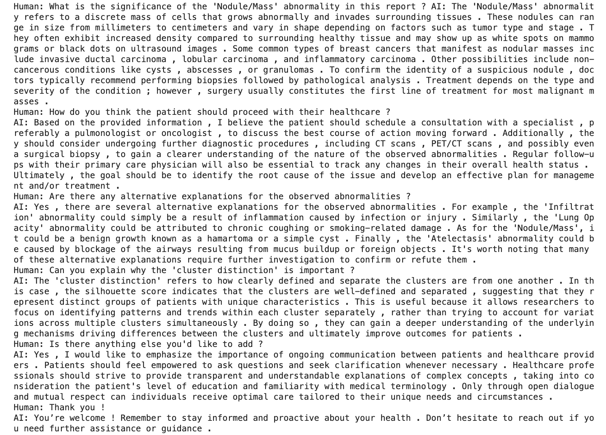

# Chest X-ray Reporting System - Generating Automated Medical Reports from X-ray Images

Welcome to the **Chest X-ray Reporting System**, a comprehensive AI-powered tool that generates detailed medical reports from chest X-ray images. This system combines **supervised learning** for detecting abnormalities and **unsupervised learning** for feature analysis, all tied together with an advanced **language model** to produce reports that mimic real-world medical expertise.

The goal of this project is to automate the interpretation of chest X-ray images, helping radiologists make faster and more accurate diagnoses. By blending the best of computer vision, unsupervised clustering, and language generation, this system moves beyond traditional image analysis, adding a new layer of medical understanding to each report.

## The Problem

Chest X-rays are one of the most common and important diagnostic tools in medicine. However, interpreting these images takes time and requires the expertise of skilled radiologists. The need for **automated solutions** has never been greater, especially in regions with limited access to medical professionals.

This project aims to address this problem by developing an AI system that can:
1. **Detect abnormalities** in X-ray images using object detection techniques.
2. **Cluster image features** based on similarity, creating descriptive summaries for different groups of abnormalities.
3. **Generate a natural language report** based on the detected issues and their clinical relevance.

## Why This Approach?

We wanted to go beyond a basic image classification system. Here's why this approach was chosen:

1. **Supervised Learning for Precision**: Supervised learning via a **Faster R-CNN model** ensures precise detection of abnormalities, providing bounding boxes and class labels for the specific conditions present in the X-ray.
2. **Unsupervised Learning for Deeper Understanding**: Using **DenseNet** for feature extraction and **K-means clustering**, we group the X-ray images into clusters of similar characteristics. Each cluster is described by an **LLM** (Large Language Model) to offer deeper insights into the overall nature of the X-ray. This brings a holistic understanding beyond just bounding boxes.
3. **Natural Language Report Generation**: By leveraging a **LLM** model, we combine the results of the object detection and clustering into a detailed, readable medical report. This is crucial because the system doesn't just provide raw data—it interprets the findings in a way that can be useful for healthcare professionals.

## The Intuition Behind the System

The intuition behind this project is that **X-ray images contain far more than just isolated areas of abnormality**. There are patterns, textures, and overall characteristics that can reveal much about the patient’s health. By combining precise object detection with feature clustering, we can produce **more informative, context-aware reports**.

Rather than simply stating, “this patient has a pleural effusion,” the system goes a step further, analyzing the entire image for its overall characteristics and explaining how this finding fits into the larger picture of the patient’s health.

---

## System Workflow - The Architecture

The system architecture follows a two-branch pipeline: **Supervised** and **Unsupervised Learning**, both contributing to the final report.

### 1. Image Preprocessing

When an X-ray image is inputted, it undergoes basic preprocessing:
- **Resized** to a standard size (e.g., 512x512) to maintain consistency across the pipeline.
- **Normalization** of pixel values is applied to make the image ready for analysis.

### 2. Supervised Branch - Object Detection

The first branch focuses on **object detection** to identify abnormalities in the X-ray image:
- We use **Faster R-CNN**, a state-of-the-art model for detecting regions of interest.
- **Bounding boxes** and **class labels** (e.g., ‘Aortic enlargement’, ‘Pulmonary fibrosis’) are extracted.
- This gives us precise locations of abnormalities, essential for understanding specific issues.

> This branch ensures that no critical detail in the X-ray image is missed. We chose Faster R-CNN for its superior performance in medical image segmentation tasks, especially in locating small or subtle abnormalities.

### 3. Unsupervised Branch - Feature Clustering

The second branch uses **feature extraction** and **clustering** to provide a broader view:
- We use a **DenseNet** pre-trained on X-ray images from **TorchXRayVision** to extract deep feature maps. These feature maps capture patterns in the image that go beyond individual abnormalities.
- These features are reduced in dimensionality using **Incremental PCA**, and then grouped into **20 clusters** using **K-means**.
- Each cluster is assigned a descriptive summary by a pre-trained **LLM**. This description provides insights such as common characteristics and potential conditions the cluster is associated with.

#### Why Clustering? 

- X-ray images are complex, and individual abnormalities don't tell the whole story. Clustering allows us to **group images based on overall similarity**, giving radiologists a way to see how this patient’s X-ray compares to others.
- By associating the image with a specific cluster, the system provides additional **clinical context** that enhances the overall interpretation.

---

## Why Did We Use K-means and PCA?

In medical image analysis, it's often challenging to **interpret complex patterns** in a large dataset. **K-means clustering** is an efficient way to group similar feature maps, helping us draw more general conclusions about the X-ray. Here's why we used **K-means**:
- **Scalability**: K-means works well with large datasets when combined with **PCA** for dimensionality reduction.
- **Interpretability**: Each cluster represents a group of images with shared characteristics. This makes it easier for the LLM to provide a **clear description** of the cluster’s clinical significance.

### Why Use WCSS and Silhouette Score?

To choose the optimal number of clusters, we used the **Within-Cluster Sum of Squares (WCSS)** and **Silhouette Score**:
- **WCSS** measures how tight the clusters are. Lower values mean the data points within each cluster are closer together, indicating better-defined clusters.
- **Silhouette Score** evaluates how similar an object is to its own cluster compared to other clusters. Higher scores suggest well-separated, distinct clusters.

**Visualizations**:
- **3D Cluster Visualization** shows how well the images are grouped into different clusters in a 3D space.
- **t-SNE Visualization** provides a 2D representation of the clusters for easier interpretation.

By visualizing these clusters, we can ensure that the images are grouped meaningfully, and radiologists can easily understand the relationships between different clusters.

---

## Report Generation - Combining It All Together

After both branches have processed the image, their outputs are combined:
- **Bounding box information** from the Faster R-CNN model (locations and labels of abnormalities) is used as the basis for object-specific findings.
- **Cluster descriptions** from the unsupervised branch provide a broader view, explaining how the entire image relates to other X-rays in the dataset.

These two sources of information are **merged into a prompt**, which is passed to a **LLM** (specifically, **Llama-3.1-MedPalm2-imitate-8B-Instruct**) to generate a detailed medical report. This report includes:
- A summary of detected abnormalities.
- Clinical relevance based on the cluster description.
- A detailed interpretation, suggesting potential diagnoses.

> **Why Use an LLM?** We wanted to create a report that isn’t just a collection of findings but a coherent, detailed explanation. An LLM allows us to combine the results of object detection and clustering into a narrative that a human radiologist can easily understand.

---

## Interactive Questioning with LangChain

One of the key features of the system is its **interactive questioning** capability. Once the report is generated, healthcare professionals can ask **follow-up questions** about the results. This is enabled by **LangChain**, which helps the system maintain **context** from previous answers, making it possible to ask detailed, nuanced questions about the X-ray.

---

## Modularity and Scalability

The system is designed to be highly **modular** and **loosely coupled**. This means:
- **Components can be easily swapped out**: For example, you could replace Faster R-CNN with another object detection model or use a different LLM for report generation.
- **Scalability**: The use of **PCA** and **K-means** allows the system to scale to larger datasets without compromising performance.

By separating each stage of the process, this architecture enables **flexibility** and **adaptability**. It’s easy to update or improve individual components without disrupting the whole system.

---

## Feature Scope

Initially, we considered a **fully deep learning-based approach** by combining the visual features from DenseNet with the bounding boxes and associated class labels using **VisualBERT**, a multi-modal model that can handle both text and visual inputs through an attention-based mechanism. The idea was that VisualBERT would **jointly learn from both the visual features and textual labels**, using the power of self-attention to **understand the relationships between visual objects and text**. 

The benefit of this approach would have been a model capable of not only identifying regions of interest but also **learning contextual information from the text to improve understanding and reporting**. However, this method requires significant **fine-tuning** to work effectively, especially in the medical domain where **expert-labeled datasets** are sparse, and **compute resources** are limited.

Due to the lack of available medical reports for training and the compute resources required for this approach, we switched to the current hybrid approach. The chosen architecture still provides **explainable results** with the flexibility to combine object detection and unsupervised learning but avoids the complexity and resource demands of a fully joint model.

---

## Examples of Generated Outputs
This section demonstrates real outputs generated by the system when a chest X-ray image is provided as input. The outputs include:

1. A chest X-ray image with predicted bounding boxes for detected abnormalities using the Faster R-CNN model.
2. A detailed medical report generated by combining the results from the supervised (Faster R-CNN) and unsupervised (DenseNet + K-Means clustering) branches.
3. An interactive follow-up Q&A session using the Langchain framework integrated with the LLM.

**Example 1: Bounding Boxes and Generated Medical Report**
Below is an example of a chest X-ray image, where the system has predicted bounding boxes for detected abnormalities. The corresponding medical report provides an analysis of these findings.

- **Bounding Boxes**: Red boxes indicate detected abnormalities.
- **Report**: The report outlines potential diagnoses and clinical insights based on the identified regions.

**Example 2: Follow-up Question and Answer**
The system also allows follow-up questions based on the medical report. Here’s an example of a conversation where further questions are asked about the abnormalities, and the system provides medically relevant answers.

---

## Conclusion

The **Chest X-ray Reporting System** combines advanced AI techniques to provide an **intelligent, modular approach** to medical image analysis. With this system, radiologists can benefit from **automated, detailed reports** generated from chest X-rays, ultimately improving patient outcomes. The blend of object detection, clustering, and natural language generation creates a powerful tool for the future of healthcare.

---

## Links to Submodules

- [Pre-processing README](https://github.com/bhanup6663/chest_x_ray_reporting/blob/main/pre-processing/README.md)
- [Segmentation Model README](https://github.com/bhanup6663/chest_x_ray_reporting/blob/main/segmentation_model/README.md)
- [Unsupervised Learning README](https://github.com/bhanup6663/chest_x_ray_reporting/blob/main/unsupervised/README.md)
