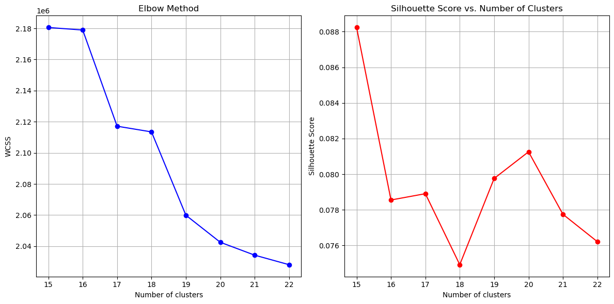
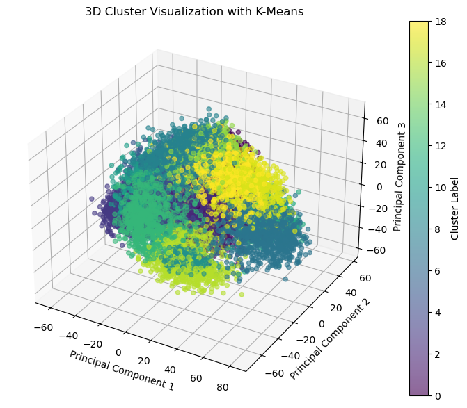
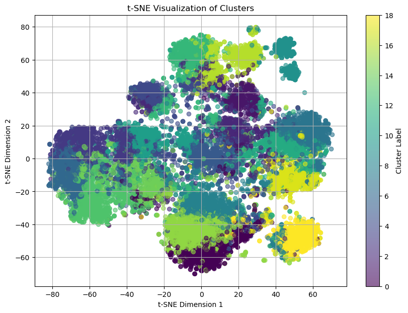

# Unsupervised Clustering in Chest X-ray Analysis

This report details the **unsupervised learning branch** of our project, where we performed K-means clustering on image feature maps extracted from chest X-ray images using a DenseNet model pre-trained on X-rays. Our objective was to cluster similar X-ray features, associate new images with these clusters during inference, and generate descriptions for each cluster.

## 1. Visual Feature Extraction (visual_feature_extraction.ipynb)

We used the **TorchXRayVision** library, which is specialized for medical imaging and comes with pre-trained models for chest X-rays. 

### TorchXRayVision Library:
- **Domain-specific**: TorchXRayVision is tailored for X-ray imaging tasks, making it the ideal choice for analyzing chest X-rays.
- **Robust Pre-trained Models**: The library provides pre-trained models like **DenseNet**, which capture essential structures and abnormalities in chest X-ray images.

### DenseNet for Feature Extraction:
- We used **DenseNet**, which was pre-trained on large-scale chest X-ray datasets. This model provided robust feature maps for each input image, which we then used for clustering.
- Input images were **normalized and resized** to **224x224 pixels** for consistency across the dataset.
- Features were extracted from the **"features"** layer of the DenseNet, capturing high-level representations of the X-ray images.

```python
model = xrv.models.DenseNet(weights="densenet121-res224-all").to(device)
```
### Feature Storage:
- Features were stored in JSON format for efficient handling of large datasets.
- The extracted feature maps were flattened and saved incrementally, allowing us to process them later during the clustering phase.

```python
f.write(f'"{img_name}": {json.dumps(features)}')
```

## 2. Dimensionality Reduction and K-Means Clustering (kmeans.ipynb)
Clustering on high-dimensional feature maps is computationally expensive. To make this feasible, we applied Incremental PCA to reduce the dimensionality of the feature maps before performing K-means clustering.

### Incremental PCA:
- We experimented with various numbers of principal components to balance dimensionality reduction with information retention:
    - 50 components explained 72% variance.
    - 100 components explained 80% variance.
    - 150 components explained 85% variance.
    - 200 components explained 90.29% variance, providing an optimal trade-off.

## K-Means Clustering Process:
- Within-Cluster Sum of Squares (WCSS):
    - WCSS measures the compactness of clusters. A lower WCSS value indicates that data points are tightly packed around the cluster centroid.
    - We used the Elbow Method to determine the optimal number of clusters, aiming to minimize WCSS.
- Silhouette Score:
    - The Silhouette Score measures the separation of clusters. A higher score (close to 1) means that the clusters are well-separated and distinct.
    - A peak silhouette score of 0.088 at 19 clusters indicated well-separated clusters in our dataset.

## Cluster Selection:
Based on the Elbow Method for WCSS and the Silhouette Score, we selected 19 clusters as the optimal number. These clusters provided a meaningful grouping of similar X-ray features.

### WCSS and Silhouette Score Plots:
Below are the WCSS and Silhouette Score plots that were used to select the optimal number of clusters.



## Cluster Visualization:
To visualize the clusters and verify their distinctiveness, we used the following methods:
- **3D Cluster Visualization with PCA**: We used the first three principal components to generate a 3D scatter plot of the clusters, helping us visually confirm the separation between clusters.



- **t-SNE Visualization**: A 2D visualization technique, t-SNE, was applied to map the high-dimensional feature maps into a two-dimensional space for a more intuitive inspection of cluster separations.



## 3. Cluster Descriptions and Inference (kmeans_clusteranalysis_discriptions.ipynb)
Each cluster was described using various statistical measures such as **mean, standard deviation, variance, and more**. These statistics were then passed to a **Llama-3.1-MedPalm2-imitate-8B-Instruct** LLM to generate descriptive insights about each cluster.

### Cluster Statistics:
- For each cluster, we computed:
    - Mean, standard deviation, and variance.
    - Median, skewness, kurtosis, and interquartile range (IQR).
    - Mode, entropy, and silhouette scores.

```python
cluster_stats = {
    'mean': cluster_mean.tolist(),
    'std': cluster_std.tolist(),
    'variance': cluster_variance.tolist(),
    'median': cluster_median.tolist(),
    'min': cluster_min.tolist(),
    'max': cluster_max.tolist(),
    'range': cluster_range.tolist(),
    'skew': cluster_skew.tolist(),
    'kurtosis': cluster_kurtosis.tolist(),
    'iqr': cluster_iqr.tolist(),
    'mode': cluster_mode.tolist(),
    'count': cluster_count,
    'entropy': cluster_entropy,
    'cv': cluster_cv.tolist(),
    'silhouette': cluster_silhouette.tolist()
}
```

### LLM for Cluster Descriptions:
- The **Llama-3.1-MedPalm2-imitate-8B-Instruct** LLM generated detailed descriptions for each cluster based on the computed statistics.
- These descriptions provided clinicians with interpretability, explaining what each cluster represented and highlighting potential abnormalities.

## Analysis of the Approach and Benefits
### Why This Approach?

- **Clustering Domain-Specific Feature Maps**: Clustering X-ray feature maps helps us identify natural groupings of images, which are useful for identifying similar medical conditions or anatomical structures.
- **Interpretability**: By using an LLM to describe clusters, clinicians can better understand the model's findings and the underlying patterns in the X-ray data.

### Computational Efficiency:
- **Incremental PCA** allowed us to reduce the high-dimensional feature maps without hitting memory limits, making the clustering process computationally feasible.
- **K-Means Clustering** provided a simple yet effective way to group images, leveraging the reduced-dimensionality data from PCA.

### Clinical Relevance:
By grouping X-rays into clusters and providing descriptions for each cluster, we enabled clinicians to interpret the model’s outputs and better understand common patterns in the dataset. This approach brings both computational efficiency and domain-specific insights, making it a highly valuable tool for medical imaging analysis.

## Conclusion:
The unsupervised clustering approach described here offers a scalable, interpretable, and clinically relevant solution for analyzing chest X-ray data. By combining feature extraction, dimensionality reduction, K-means clustering, and LLM-generated descriptions, we provided a comprehensive framework for classifying and interpreting medical images, ultimately assisting radiologists in making data-driven clinical decisions.


